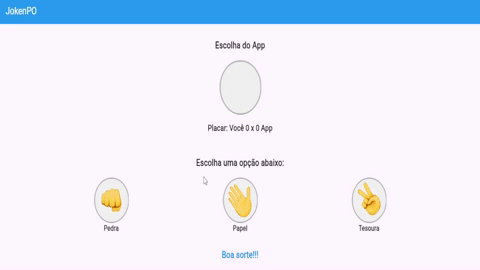

<h1 align="center">JokenPo</h1>

 Este sistema é um aplicativo de JokenPo (Pedra, Papel e Tesoura) desenvolvido em Flutter. Nele, o usuário escolhe uma jogada e compete contra uma escolha aleatória do sistema. O aplicativo possui um placar em tempo real e animações interativas, proporcionando uma experiência simples e dinâmica. O projeto foi criado na plataforma FlutLab e está disponível para testar aqui abaixo.  
<a href="https://guilhermesandrade.github.io/JokenPo/">Teste aqui o Projeto</a>

<h1 align="center"> 👀 Resultados</h1>

 
 

<h1 align="center"> 💻 Sobre o Projeto</h1>

Este é um aplicativo de JokenPo (Pedra, Papel e Tesoura) desenvolvido em Flutter utilizando a plataforma FlutLab. O jogo permite que o usuário escolha entre pedra, papel ou tesoura e enfrente a escolha gerada aleatoriamente pelo sistema. Ao realizar uma jogada, o sistema compara as escolhas e exibe o resultado informando se o usuário venceu, perdeu ou empatou.

O aplicativo possui um placar que registra e exibe em tempo real a quantidade de vitórias, derrotas e empates, permitindo ao usuário acompanhar seu desempenho durante as partidas. Além disso, foram implementadas animações interativas para tornar a experiência mais dinâmica e visualmente agradável, como a resposta visual ao clicar em um botão e a transição suave entre os estados do jogo.

A aplicação foi construída com base no framework Flutter, conhecido por sua eficiência na criação de interfaces modernas e responsivas. Todo o desenvolvimento foi realizado na plataforma FlutLab, que permite a criação e teste de projetos Flutter diretamente no ambiente online.

O projeto está hospedado no GitHub Pages, possibilitando o acesso fácil e rápido ao jogo diretamente pelo navegador, sem a necessidade de instalação em dispositivos. Este projeto destaca o uso de lógica de programação para gerenciar a aleatoriedade do sistema e o controle do estado do jogo, além de demonstrar habilidades na utilização do Flutter para o desenvolvimento de interfaces ricas em interatividade.

<h1 align="center">🚀 Tecnologias usadas:</h1>

- Flutter: Framework utilizado para o desenvolvimento do aplicativo, proporcionando uma interface responsiva e interativa.

- Dart: Linguagem de programação usada para implementar a lógica do jogo e gerenciar os estados do aplicativo.

- FlutLab: Plataforma online utilizada para o desenvolvimento e a compilação do projeto Flutter.

- GitHub Pages: Serviço utilizado para hospedar e disponibilizar o aplicativo na web de forma gratuita.</a>

 

 
Código disponivel em:<strong> "codigo_jogo_dart.txt"</strong>
